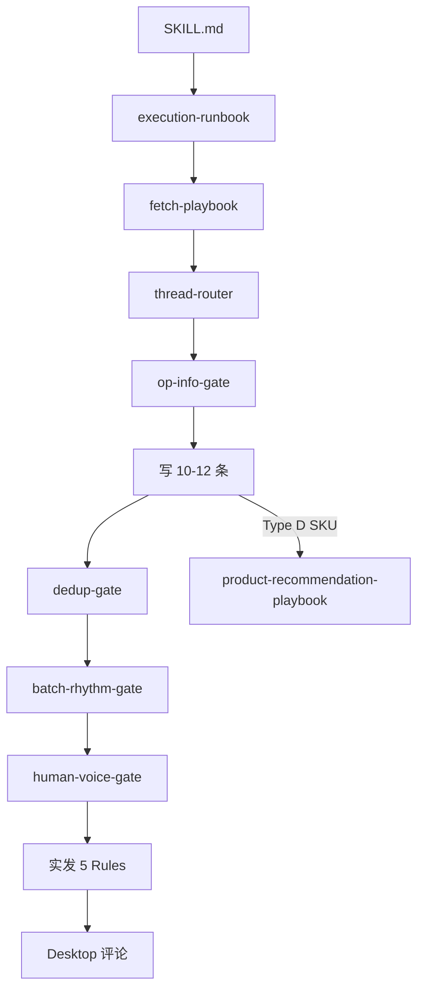

# 技能结构 · 信息层级与正确性

> 维护者：改规则时 **先改本文冲突表**，再改子文件。  
> 执行：**`execution-runbook.md` 唯一入口**。

---

## 结构图

---

## 运行时 vs On-demand

| 运行时（每次） | On-demand |
|----------------|-----------|
| execution-runbook（含 style-guide **核心 5 条**） | quality-comment-examples（单节） |
| thread-router · op-info-gate | comment-style-guide（完整版） |
| dedup · batch-rhythm · human-voice | communities · subreddit-context |
| batch-output-template · quality-checklist | keyboard-domain-guide · account-safety |
| real-comments · mk-thread-samples | research-protocol（Type D 时升必读） |
| product-recommendation-playbook（Type D） | comment-patterns（已废弃执行） |

---

## 规则冲突 · 已裁定

| 冲突 | 裁定 |
|------|------|
| Show don't conclude vs Filler | Filler 豁免 |
| 5 Rules vs 10–12 备选 | **仅实发 1 条** 跑 5 Rules；备选 **3 项** |
| 禁假史 vs 第一人称 | 禁持 SKU · 可 I'd / 配列经历 |
| Tradeoff vs info_thin | **thin → Tradeoff 0** |
| 具名 SKU vs 摩擦 | Scratchy 禁 depends+SKU；核实行尾必填 URL |
| 节奏 vs 单条属性 | **batch-rhythm** 整批先于选实发 |
| style-guide 核心 vs human-voice 配比 | **原则** 在 runbook Phase 2 写前必读；**配比** 在 human-voice Phase 3 |
| Scratchy vs 装饰 tbh | **句法测试**：删 tbh/idk 后仍完整句 → 假摩擦 |

---

## 信息正确性清单

- [ ] `info_density` 已填
- [ ] `节奏自检` ✓
- [ ] 具名 SKU 有 `核实来源` 块
- [ ] `info_thin` 无 Tradeoff/具名推荐实发
- [ ] dedup 无顶评撞车

*路径：`reddit-keyboard-comments/references/skill-map.md`*
