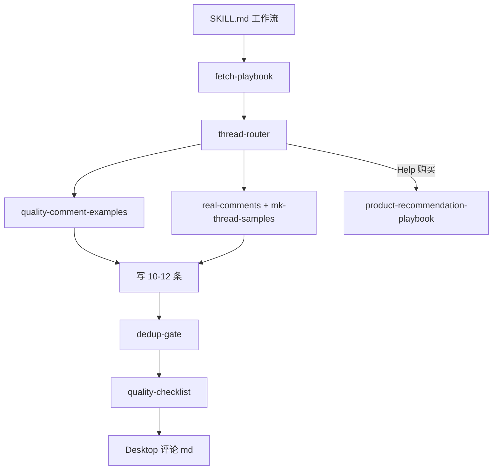

# 技能结构 · 信息层级与正确性

> 维护者：改规则时 **先改本文冲突表**，再改子文件。  
> 唯一目录：`.cursor/skills/reddit-keyboard-comments`

---

## 结构图

---

## 文件职责（单源真相）

| 层级 | 文件 | 权威内容 |
|------|------|----------|
| L0 | `SKILL.md` | 边界 · 工作流 · 输出格式 · Filler 默认 |
| L1 路由 | `thread-router.md` | **thread_mode** · 批量配比 · mode 禁则 |
| L1 抓帖 | `fetch-playbook.md` | old.reddit URL · 失败处理 |
| L1 撞车 | `dedup-gate.md` | 顶评摘录 · 撞车标 |
| L2 写法 | `quality-comment-examples.md` | 帖型长例（Help/Gallery/故障） |
| L2 语气 | `real-comments.md` | MK 短句 · **禁假史** |
| L2 实证 | `mk-thread-samples.md` | 锚帖顶评原文 |
| L2 禁词 | `comment-style-guide.md` | AI Ban List · Show don't conclude |
| L3 发前 | `quality-checklist.md` | Filler vs Help 分流检查 |
| L3 输出 | `batch-output-template.md` | 桌面 md 字段 |
| 条件 | `product-recommendation-playbook.md` | Type D 规格 · 禁未核实 SKU |
| 背景 | `communities.md` · `subreddit-context.md` | 版规 · 两 sub 差异 |

**不要** 在多个文件重复定义 Filler 条数 — 以 `thread-router.md` + `SKILL.md` 为准。

---

## 规则冲突 · 已裁定

| 冲突 | 裁定 |
|------|------|
| Show don't conclude vs Filler `looks good` | **Filler/Reaction 豁免**；🟡 Observation/Help 才需具体件 |
| quality-checklist「5 Rules」vs Filler | **分流**：Filler 用 ≤8 词检查；Help 用 5 Rules |
| real-comments「具体细节型」vs SKILL 禁假史 | **禁编造** `had mine 3 weeks`；可写 OP/楼已出现的事实 |
| comment-style-guide「Never conclude」vs Gallery 短夸 | Gallery `gallery_*` 跟顶评，可空夸 **1 词** |
| `curious how you're liking…`（examples §8） | **仅** OP 问体验/用后感；Gallery 楼聊图时 **禁用** |
| 10–12 条 vs 实发 0–1 | 10–12 = **备选池**；`saturated_meme` 实发常 **0** |
| Tradeoff 骨架 vs 人味 | Help 批 **Tradeoff ≤1** · 见 `human-voice-gate.md` |
| 禁假史 vs 第一人称 | 禁 **持某 SKU** · 可 **I'd / 配列经历 / tbh idk** |
| 具名推荐 vs spec 表 | 一句 **一个点** · 空楼禁总结陈词 · 系列分裂禁笼统推 |

---

## 信息正确性清单（改技能必查）

- [ ] `thread_mode` 与顶评链一致（非只读 OP）
- [ ] 顶评摘录为 **原文**（`dedup-gate`）
- [ ] 无顶评逐字复刻
- [ ] Gallery 楼未接 build → 无轴/壳顾问
- [ ] 无假购买史 / 假 `bugged me too`
- [ ] Type D 规格经 playbook / 核实
- [ ] 情绪档跟顶评，无 `tough`/`insane` 进 MK Gallery

---

## 非本技能

- `reddit-keyboard-promotion` — NSQ/Ask 等多社区
- `real-comments.md` 附录 AskReddit/NBA — **勿当 MK 默认语气**

*路径：`reddit-keyboard-comments/references/skill-map.md`*
