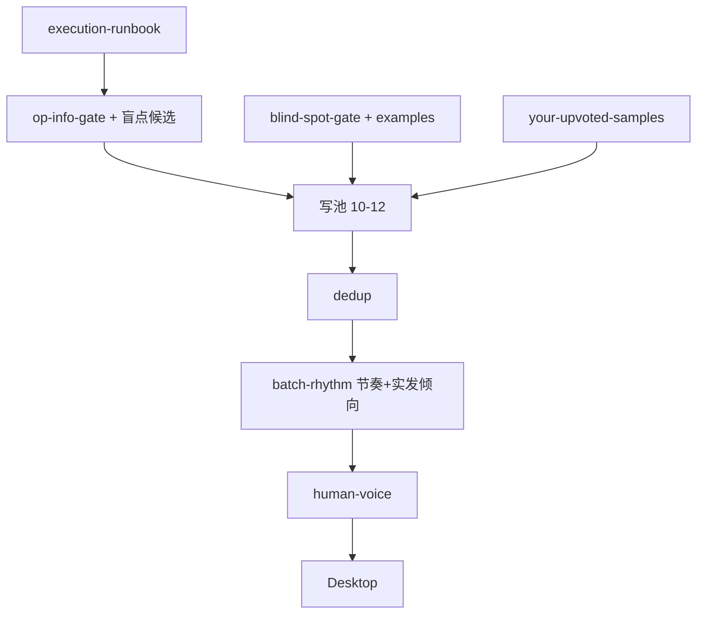

# 技能结构 · 信息层级与正确性

> 执行：**`execution-runbook.md`**。样例按 **得赞原因** 优先于按类型。

---

## 结构图

---

## 运行时 vs On-demand

| 运行时 | On-demand |
|--------|-----------|
| runbook · op-info · blind-spot-gate · blind-spot-examples | quality-comment-examples |
| dedup · batch-rhythm · human-voice | comment-style-guide 全文 |
| your-upvoted-samples · batch-output-template | real-comments（短句表，次优先） |
| thread-router · fetch | mk-thread-samples（顶评长度） |

---

## 规则冲突 · 已裁定

| 冲突 | 裁定 |
|------|------|
| 不像 AI vs 有用 | **Blind Spot**：具体+随口+核实；不靠纯废话实发 |
| info_thin vs 盲点 | thin 禁 SKU **推荐** · **允许 0–1 核实盲点** |
| 观察 vs 盲点 | OP 已述困境 ≠ 盲点（`blind-spot-examples` 反例） |
| 共鸣 vs 节奏 | 共鸣须 thread **未说过**；仅 lol = 节奏 |
| 5 Rules vs 备选 | 仅 **实发 1 条** 跑 5 Rules |
| 例子按类型 vs 得赞 | 金样/盲点例 **得赞原因轴**；real-comments 次优先 |

*路径：`reddit-keyboard-comments/references/skill-map.md`*
