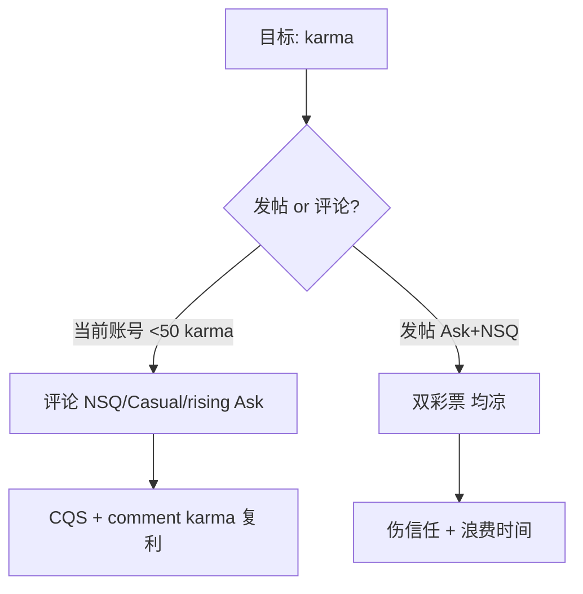

# 发帖策略重校准（AskReddit + NSQ 双凉）

> **非技能默认。** 主路径是 `communities.md`（版规 + 形态）。仅当用户 **明确要求** 养号/日程策略时再读本文件。  
> 以下为历史调研备忘，Agent 勿主动建议「14 天停发帖」等，除非用户问起。

---

## 1. 双凉说明什么（不是「题不好」两次）

| 误解 | 实际 |
|------|------|
| Ask 题差、NSQ 题差 | **发帖这条路径** 对当前账号不适用 |
| 换标题就能火 | 两版竞争池、算法、账号信任 **完全不同**，同时 flop = **模式问题** |
| 评论也会一样凉 | 若评论有 5–20 票而发帖 0–3 票 → **确认：只发帖有问题** |

**共同死因（两版叠加）：**

1. **原型错配 + 阶段错配** — 阶段 A（&lt;50 karma）技能默认 **评论 70%**；连续在大版 **开奖帖** = 与数据相反  
2. **早期速度未达标** — 两版都靠 **首 1–3 小时评论链**；3/3 或 2/2 = 未进 rising  
3. **Ask 特有：** lurker 标题票 + 饱和 + *seen someone* 见证问法（见 `askreddit-post-playbook.md` §10）  
4. **NSQ 特有：** 月 Top 多数 **有正文锚点**；仅标题或 FAQ 腔 = 低票体（见 `subreddit-nsq-post-karma-research.md` §7）  
5. **账号信号：** 新号短时间 **两 sub 各发一帖** ≈ spam/karma farm 模式 → CQS 风险（`account-building-guide.md`）  
6. **期望值：** NSQ 普通帖 **0–20 post karma** 常见；Ask 更彩票；**双试皆底部** = 正常分布，不是异常



---

## 2. AskReddit vs NSQ：为何「同一套想法」会都死

| 维度 | r/AskReddit | r/NoStupidQuestions |
|------|-------------|---------------------|
| **产品** | 标题舞台；评论=内容 | **真回答** + 常需 **正文场景** |
| **发帖竞争** | 极高（数千/日） | 高；但 **周 Top 25 ≈1900 票** 已低于年榜 |
| **标题** | 50–200 字 hook；lurker 先投票 | 完整问句 + **个人锚点** |
| **正文** | **必须空白**（Rule 1） | **推荐 2–4 句**（场景+已搜过） |
| **爆款基因** | 民意假想/荒诞/时效 | 通胀叙事、图书馆害羞、文化错位（§7.2 A–D） |
| **Flop 典型** | 饱和子话题、见证他人、无 3 秒 hook | FAQ 腔、无细节、2h &lt;5 评 |
| **稳定 karma** | **评论** `/rising` | **评论** `/new` 0–8 评 |

**不能做的迁移：**

- ❌ 把 Ask 标题 **原样** 发 NSQ（缺正文锚点）  
- ❌ 把 NSQ 真诚长文 **缩成** Ask 标题（Ask 要不同 hook）  
- ❌ 两版同一天各发 1 帖「试运气」

---

## 3. 立即执行：14 天发帖冻结

### 3.1 硬规则（Agent 对用户默认建议）

| 天数 | 动作 |
|------|------|
| **1–14** | **0 发帖**（Ask + NSQ + 其他大版） |
| 每天 | **2–3 条评论**，跨 **2+ sub**，间隔 2–4h |
| 每周 | NSQ ≤2 条 + Casual 或 Ask **rising 评论** 1 条 + 可选 NewToReddit |

### 3.2 评论分工（替代发帖）

| Sub | 去哪 | 写什么 |
|-----|------|--------|
| **NSQ** | `/new`，0–8 评 | 12–35 词，**一句机制**；`subreddit-nsq-comment-playbook.md` |
| **AskReddit** | `/rising` | 5–25 词，接梗/一句 insight；**不发帖** |
| **CasualConversation** | `/new` 生活帖 | 3–15 词共鸣 |
| **键盘** | BudgetKeebs 周帖 / Ergo | 15–35 词单线（若相关） |

### 3.3 成功指标（14 天后）

- [ ] 最近 10 条评论 **≥50%** 有 ≥1 upvote  
- [ ] 无 automod 删评、无「karma 不变只有自己在看」  
- [ ] comment karma **+30~80**（因活跃度而异）  
- [ ] 未再发帖  

→ 达标后才考虑 **每周 ≤1 帖**，且 **只 NSQ**（见 §5），Ask 再延后。

---

## 4. 自检：帖是「凉」还是「被滤」

让用户 **无痕/另一账号** 查：

| 检查 | 被滤 | 真凉 |
|------|------|------|
| 帖在 `/new` 可见 | 否 | 是 |
| 别人能否评论 | 否 | 是 |
| 评分长期 1（仅自顶） | 可能 | 3/3 更像真凉 |

被滤 → 停发帖 7 天；只 **Casual/NewToReddit** 短评；验证邮箱+2FA（`account-building-guide.md`）。

---

## 5. 14 天后若再发帖：只开 NSQ，且换形态

**仍不建议立刻回 AskReddit 发帖**（彩票 + 你已有一次 flop 样本）。

### 5.1 NSQ 发帖门槛

- comment karma **≥50**  
- 通过 `subreddit-nsq-post-karma-research.md` **§7.5 评论 bait 自检 ≥6/10**  
- FAQ + sub 内 **零** 同题  
- 必须有 **正文**（类型 B 图书馆 / 类型 D 文化错位 最易学）

**模板（类型 B — 新号相对安全）：**

```
标题: Can I [具体日常行为] without [具体担心]?

正文（3–4 句）:
- 你是谁/在哪（一句）
- 你为什么问（真诚）
- 你已经试过/查过什么（一句）
```

**禁止：** 年榜政治/医疗/通胀 rant 仿写；FAQ 题；AI 作文腔。

### 5.2 AskReddit 再发帖门槛（更严）

- comment karma **≥100** 且 **30 天** 内有 Ask **rising 评论** 获 ≥5 票  
- `askreddit-post-playbook.md` 结构分 **≥26/32**  
- 未撞 §5 饱和  
- 接受 **仍可能 3 票** — 仅当「真想问」而非养号

---

## 6. 对你已发两帖的处理

| 动作 | 原因 |
|------|------|
| **不要删** | 删了重发像 farm |
| **不要** 两版各再发「改进版」 | 一周 2 帖仍像 bot |
| **可选** 在 **仍开放的帖** 下认真回 1–2 条顶评（若有人问） | 略挽 OP 形象；**不** 自顶 |
| 把主题改到 **评论** | 例如省钱翻车 → NSQ `/new` 里答 *how to save money* 帖，讲 **自己** 一条 80 词故事 |

---

## 7. Agent 输出模板（用户说两版都凉）

```markdown
## 发帖策略重校准

**诊断：** Ask + NSQ 双凉 → **暂停发帖 14 天**（非单题问题）。

### 共同死因
- …（列 3–5 条：阶段 A 发帖、早期速度、Ask/NSQ 形态错配、账号 farm 模式）

### 你的两帖（若用户提供标题）
| Sub | 标题 | 主要死因 |
|-----|------|----------|
| AskReddit | … | 饱和 / witness / lurker hook / … |
| NSQ | … | 无正文锚点 / FAQ 腔 / &lt;5 评 2h / … |

### 14 天计划（每天）
- 评论 2–3：NSQ … + Ask rising … + …
- 发帖：0

### 14 天后
- 先 NSQ 1 帖（bait ≥6/10 + 正文）
- Ask 发帖：暂缓至 comment karma 100+ 且 rising 评论验证

### 勿做
删帖重发、双版同日再试、buy upvote
```

---

## 8. 文档索引

| 文件 | 用途 |
|------|------|
| `askreddit-post-playbook.md` | Ask flop、改写 |
| `subreddit-nsq-post-karma-research.md` | NSQ 正文、bait 表、月 Top |
| `reddit-community-atlas.md` | 原型、§12 flop |
| `account-phase-routing.md` | 阶段 A 评论主战场 |
| `account-building-guide.md` | CQS、过滤 |

*路径：`reddit-keyboard-promotion/references/posting-strategy-recalibration.md`*
